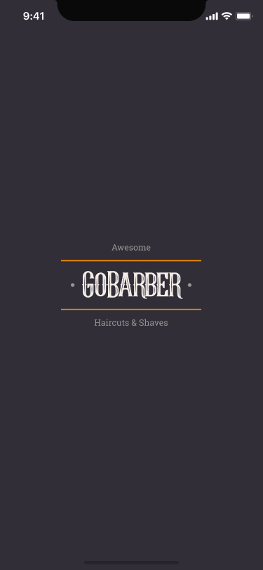
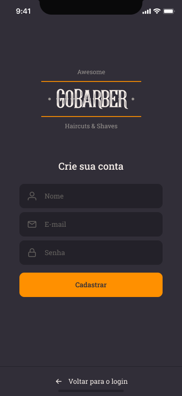

<h1 align="center">
    
    <br>
    GoBarber Mobile
</h1>

<h4 align="center">
  A barber scheduling app that allows users to schedule an appointment with his favorite barber and shows to the barber his agenda for the day.
</h4>

<div>
  
  
  
  
  
  
  
  
</div>

## :rocket: Technologies

This project was developed at the [RocketSeat GoStack Bootcamp](https://rocketseat.com.br/bootcamp) with the following technologies:

-  [React-Native](https://facebook.github.io/react-native/)
-  [React Navigation](https://reactnavigation.org/)
-  [Axios](https://github.com/axios/axios)
-  [Unform](https://unform.dev/)
-  [Yup](https://github.com/jquense/yup)
-  [date-fns](https://date-fns.org/)
-  [react-native-image-picker](https://github.com/react-native-community/react-native-image-picker)
-  [react-native-datetimepicker](https://github.com/react-native-community/datetimepicker)
-  [styled-components](https://www.styled-components.com/)
-  [VS Code][vc] with [EditorConfig][vceditconfig] and [ESLint][vceslint]


## :information_source: How To Use

To clone and run this application, you'll need [Git](https://git-scm.com), [Node.js v10.16][nodejs] or higher + [Yarn v1.13][yarn] or higher installed on your computer. From your command line:

```bash
# Clone this repository
$ git clone https://github.com/hericke47/GoBarberMobile

# Go into the repository
$ cd GoBarberMobile

# Install dependencies
$ yarn install

# Run the app (iOS)
$ yarn ios

# Run the app (Android)
$ yarn android
```

Made with much :heart: and :muscle: by Herick Exterkoetter :blush: <a href="https://www.linkedin.com/in/herick-exterkoetter-197496195/">Talk to me!</a>

[nodejs]: https://nodejs.org/
[yarn]: https://yarnpkg.com/
[vc]: https://code.visualstudio.com/
[vceditconfig]: https://marketplace.visualstudio.com/items?itemName=EditorConfig.EditorConfig
[vceslint]: https://marketplace.visualstudio.com/items?itemName=dbaeumer.vscode-eslint
